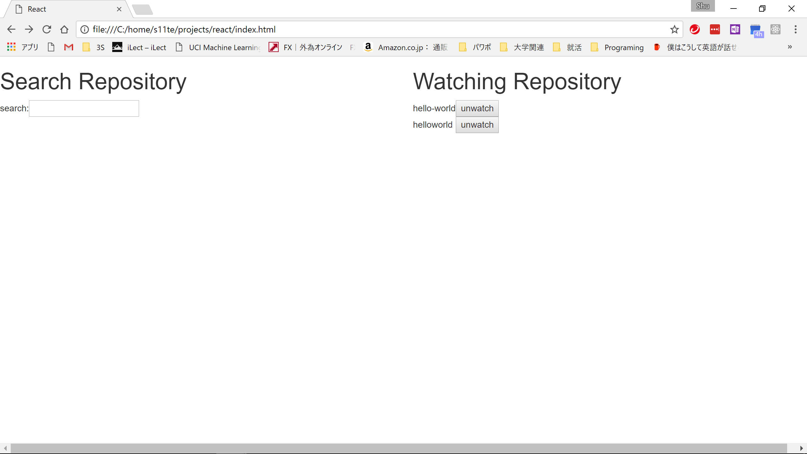

# React (Problem of Wantedly )

## Personal access token の設定場所
repository.js の２行目
```
var dispatcher = new Flux.Dispatcher();
var token = 'token '; //  <= HERE!
var _search = {data:null};
```

## 仕様
* watch/unwatchの後、しばらくしないとAPI上でwatchリストが更新されないようで、一度watch/unwatchボタンを押したのち、しばらくしてからもう一度ボタンを押さなければ、表示に反映されない。
* APIにアクセス制限があるため、多くの回数検索する（インクリメンタルサーチなので、長文を打ち込んでも同じ）と通信できなくなる。


